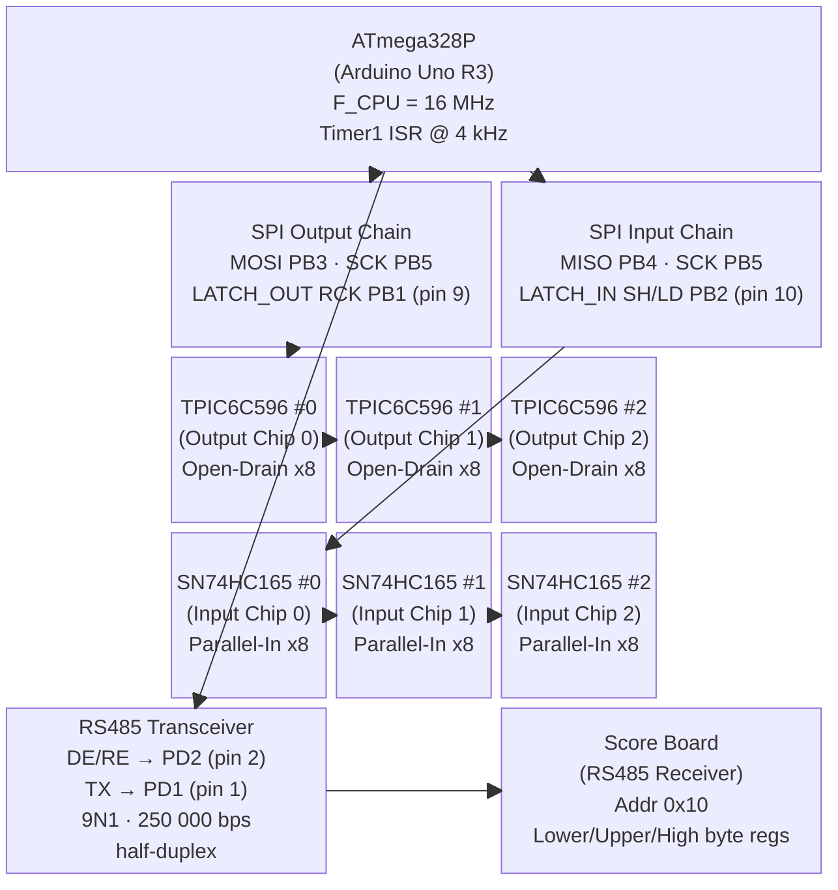
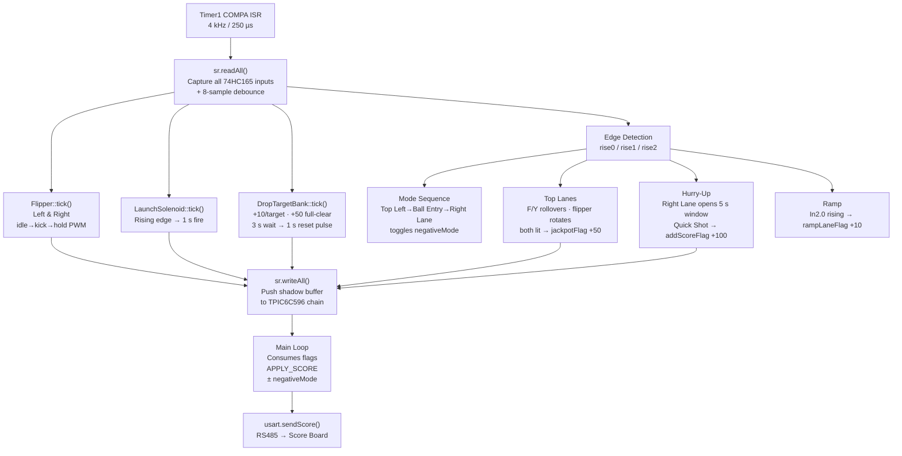

# System Diagram

---

## SPI Output Chain — TPIC6C596 Pin Assignments

| Chip | Pin | Signal | Function |
|------|-----|--------|----------|
| Out 0 | 0 | Left Flipper Solenoid | Full-power kick → PWM hold |
| Out 0 | 1 | Right Flipper Solenoid | Full-power kick → PWM hold |
| Out 0 | 2 | Launch Solenoid | 1 s fire pulse on button press |
| Out 0 | 4 | Drop Target Reset Solenoid | Pulsed 1 s after 3 s wait on full clear |
| Out 0 | 7 | Hurry-Up LED | Flashes 2 Hz during 5 s hurry-up window |
| Out 1 | 0 | F Lane LED | Lit when F top-lane rollover is active |
| Out 1 | 1 | Y Lane LED | Lit when Y top-lane rollover is active |

---

## SPI Input Chain — SN74HC165 Pin Assignments

| Chip | Pin | Signal | Function |
|------|-----|--------|----------|
| In 0 | 0 | Ball Entry Lane | Step 2 of mode-sequence; debounced |
| In 0 | 1 | F Lane Rollover | Lights F LED; top-lane jackpot logic |
| In 0 | 2 | Y Lane Rollover | Lights Y LED; top-lane jackpot logic |
| In 0 | 3 | Top Left Lane | Step 1 of mode-sequence |
| In 0 | 4 | Quick Shot Button | Awards +100 pts during hurry-up window |
| In 1 | 0 | Right Flipper Button | Flipper control + lane-light rotation |
| In 1 | 1 | Right Flipper EOS | End-of-stroke cuts kick phase early |
| In 1 | 2 | Left Flipper Button | Flipper control + lane-light rotation |
| In 1 | 3 | Left Flipper EOS | End-of-stroke cuts kick phase early |
| In 1 | 4 | Launch Button | Triggers 1 s launch solenoid pulse |
| In 1 | 6 | Right Lane | Step 3 of mode-sequence; opens hurry-up window |
| In 1 | 7 | Left Lane | General lane input |
| In 2 | 0 | Ramp Exit Sensor | Awards +10 pts per ball passage |
| In 2 | 1 | Drop Target 1 | +10 pts on hit; contributes to full-clear bonus |
| In 2 | 2 | Drop Target 2 | +10 pts on hit; contributes to full-clear bonus |
| In 2 | 3 | Drop Target 3 | +10 pts on hit; +50 bonus on full clear |

---

## RS485 / Score Board Protocol

| Detail | Value |
|--------|-------|
| MCU USART | USART0, 9N1, 250 000 bps |
| Direction control | PD2 HIGH = TX, LOW = RX |
| Frame type | 9-bit Multiprocessor Communication Mode |
| Scoreboard address frame | `0x110` (bit 8 = 1, addr = 0x10) |
| Register — lower byte | `0x001` |
| Register — upper byte | `0x002` |
| Register — high byte | `0x003` |
| Stop packet | `0x1FF` (bit 8 = 1) |
| TX buffer size | 8 frames per score update |
| Score range | 0 – 99 999 |

---

## Control Flow Summary

