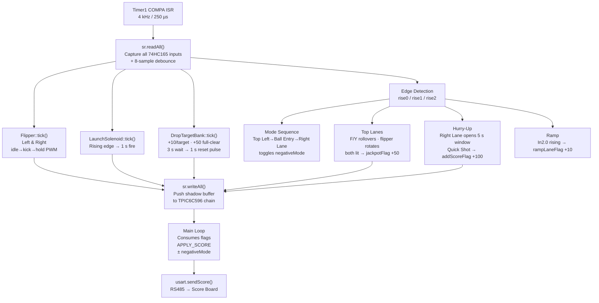

# System Diagram

```mermaid
flowchart TD
    classDef mcu     fill:#1f2d3d,stroke:#58a6ff,color:#cdd9e5,rx:6
    classDef outIC   fill:#1a3a1a,stroke:#3fb950,color:#cdd9e5
    classDef inIC    fill:#2d1f3d,stroke:#a371f7,color:#cdd9e5
    classDef commIC  fill:#3d2010,stroke:#f0883e,color:#cdd9e5
    classDef sb      fill:#1f2d3d,stroke:#f0883e,color:#cdd9e5

    MCU["🖥️ ATmega328P — Arduino Uno R3\nF_CPU = 16 MHz\nTimer1 CTC ISR @ 4 kHz  250 µs per tick\nSPI Master · USART0"]:::mcu

    subgraph OUT_CHAIN["🟢 SPI Output Chain — TPIC6C596  Open-Drain  Serial-In / Parallel-Out\nMOSI → PB3  SCK → PB5  LATCH_OUT RCK → PB1  pin 9"]
        direction LR
        OUT0["TPIC6C596 #0\n─────────────\np0 Left Flipper Solenoid\np1 Right Flipper Solenoid\np2 Launch Solenoid\np4 Drop Target Reset\np7 Hurry-Up LED"]:::outIC
        OUT1["TPIC6C596 #1\n─────────────\np0 F Lane LED\np1 Y Lane LED"]:::outIC
        OUT2["TPIC6C596 #2\n─────────────\n(reserved)"]:::outIC
        OUT0 -->|SER| OUT1 -->|SER| OUT2
    end

    subgraph IN_CHAIN["🟣 SPI Input Chain — SN74HC165  Parallel-In / Serial-Out\nMISO ← PB4  SCK → PB5  LATCH_IN SH/LD → PB2  pin 10"]
        direction LR
        IN0["SN74HC165 #0\n─────────────\np0 Ball Entry Lane\np1 F Lane Rollover\np2 Y Lane Rollover\np3 Top Left Lane\np4 Quick Shot Button"]:::inIC
        IN1["SN74HC165 #1\n─────────────\np0 Right Flipper Button\np1 Right Flipper EOS\np2 Left Flipper Button\np3 Left Flipper EOS\np4 Launch Button\np6 Right Lane\np7 Left Lane"]:::inIC
        IN2["SN74HC165 #2\n─────────────\np0 Ramp Exit Sensor\np1 Drop Target 1\np2 Drop Target 2\np3 Drop Target 3"]:::inIC
        IN0 -->|QH→SER| IN1 -->|QH→SER| IN2
    end

    subgraph RS485_BUS["🟠 RS485 Bus — USART0  9N1  250 000 bps  half-duplex\n9-bit Multiprocessor Communication Mode"]
        direction LR
        XCVR["RS485 Transceiver\n─────────────\nDE/RE → PD2  pin 2\nTX    → PD1  pin 1"]:::commIC
        SB["Score Board\n─────────────\nRS485 Receiver\nAddr 0x10\nLower byte reg 0x001\nUpper byte reg 0x002\nHigh  byte reg 0x003\nStop packet   0x1FF"]:::sb
        XCVR -->|"8-frame score packet"| SB
    end

    MCU -->|"MOSI · SCK · LATCH_OUT"| OUT_CHAIN
    MCU -->|"MISO · SCK · LATCH_IN"| IN_CHAIN
    MCU -->|"USART0 TX · DE/RE toggle"| RS485_BUS
```

---

## Control Flow Summary

```mermaid
flowchart TD
    T1["Timer1 COMPA ISR\n4 kHz / 250 µs"] --> RA["sr.readAll()\nCapture all 74HC165 inputs\n+ 8-sample debounce"]
    RA --> FL["Flipper::tick()\nLeft & Right\nidle→kick→hold PWM"]
    RA --> LS["LaunchSolenoid::tick()\nRising edge → 1 s fire"]
    RA --> DT["DropTargetBank::tick()\n+10/target · +50 full-clear\n3 s wait → 1 s reset pulse"]
    RA --> ED["Edge Detection\nrise0 / rise1 / rise2"]
    ED --> SEQ["Mode Sequence\nTop Left→Ball Entry→Right Lane\ntoggles negativeMode"]
    ED --> TL["Top Lanes\nF/Y rollovers · flipper rotates\nboth lit → jackpotFlag +50"]
    ED --> HU["Hurry-Up\nRight Lane opens 5 s window\nQuick Shot → addScoreFlag +100"]
    ED --> RM["Ramp\nIn2.0 rising → rampLaneFlag +10"]
    FL --> WA["sr.writeAll()\nPush shadow buffer\nto TPIC6C596 chain"]
    LS --> WA
    DT --> WA
    TL --> WA
    HU --> WA
    WA --> ML["Main Loop\nConsumes flags\nAPPLY_SCORE\n± negativeMode"]
    ML --> RS["usart.sendScore()\nRS485 → Score Board"]
```
